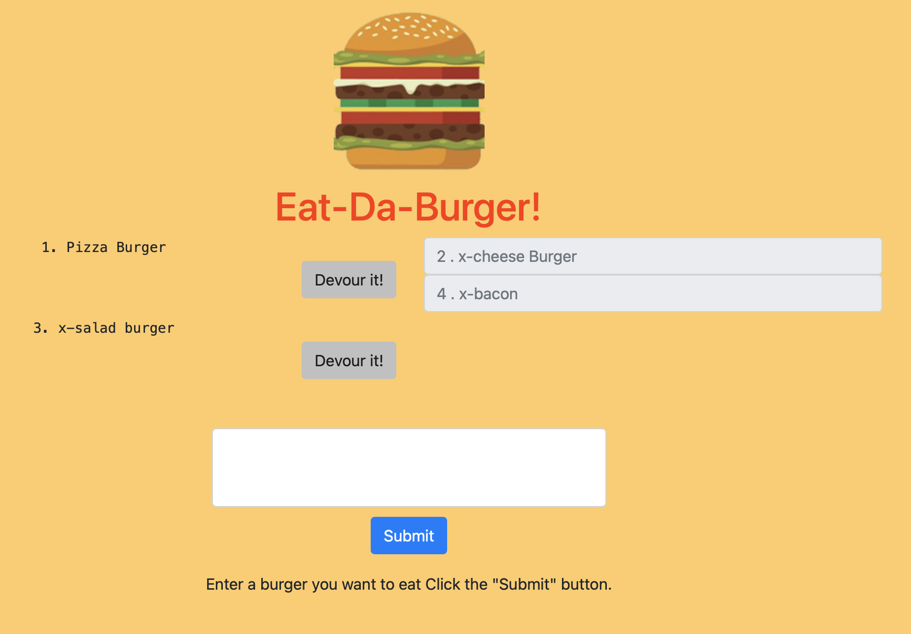
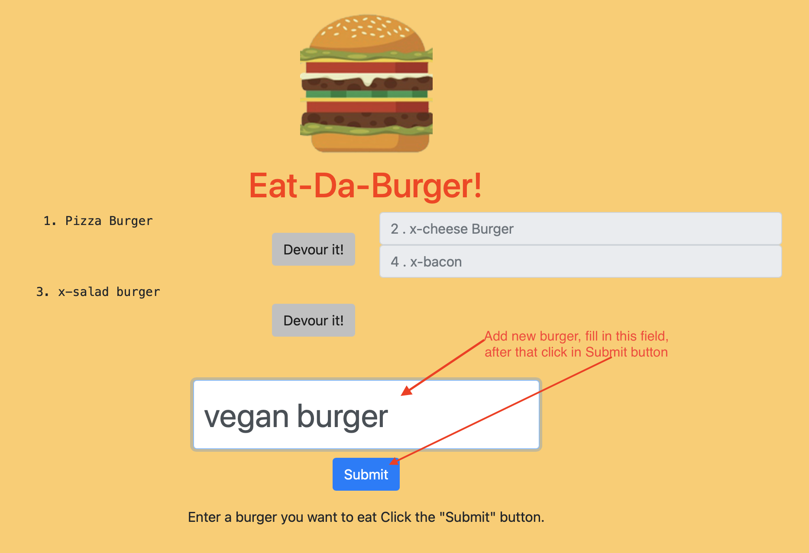

# Eat_Da_Burger_App
This burger logger was developed with MySQL, Node, Express, Handlebars and a homemade ORM (yum!)

## Install
```
npm install express
npm install express-handlebars
npm install mysql
```

## Deploy Heroku
https://mighty-fjord-92514.herokuapp.com/burgers


## Home Page


```
Add new burger 
```
